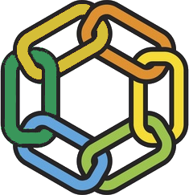

# Zagros Core

Zagros Network'ün düğüm yazılımı: konsensüs, yürütücü, işlem havuzu, ağ, RPC ve
köprü habercisi. Rust ile yazılmıştır, EVM uyumludur.

##  Zagros nedir?

Zagros, yerli parası **yalnızca altınla alınıp satılan ve fiyatı zincir içi
yerleşik havuzunda oluşan ilk ve tek Layer-1**'dir. ZAGROS yalnız ZERENYA ile
takas edilir; 1 ZERENYA, Ethereum'da köprü kasasında kilitli 1 troy ons PAXG
ile birebir teminatlıdır. Borsa yok, emir defteri yok, oracle yok: fiyat,
insanların altınla yaptığı gerçek takaslardan oluşur.

Bu tek karar zincirin her katmanına iner. Gaz altın cinsinden sabittir, ağın
tüm geliri kesintisiz stake edenlere ve doğrulayıcılara dağıtılır, sıra parayla
satın alınamaz ve arz 42 milyonda sonsuza kadar kilitlidir. Aşağıdaki liste bu ilkelerin kodda nasıl karşılık bulduğunu
özetler; ayrıntılı anlatım [zagros.network](https://zagros.network) üzerindeki
Öğren bölümünde (Diyagram ve Akademi) bulunur.

## 🌟 Öne çıkan özellikler

**📊 Para ve ekonomi**

- **Sabit arz.** 42.000.000 ZAGROS genesis'te basıldı. Protokolde basım ya da
  yakma yolu yoktur; toplam her açılışta yeniden doğrulanır.
- **Altın cinsinden sabit gaz.** Hedef ücret 0,0000125 ZERENYA (yaklaşık 0,39 mg
  altın); ZAGROS fiyatı ne olursa olsun işlemin gerçek maliyeti aynı kalır. İş
  yüküne göre çarpan: transfer 1, takas 2, köprü 3, sözleşme çağrısı 5, sözleşme
  dağıtımı 100. Yoğunlukta dinamik çarpan spam'i pahalılaştırır.
- **Tüm gelir stake edenlere ve doğrulayıcılara: Hevsel Dağıtım.** Zincirin
  ürettiği her kuruş gelir tek hazinede toplanır ve her blokta tamamı dağıtılır:
  %80 stake edenlere, %20 bloğu üreten doğrulayıcıya. Kurucuya, ekibe ya da bir
  proje cüzdanına ayrılan pay yoktur; ödül havadan basılmaz, arz sulandırılmaz.
  Ayrıntı: [Hevsel Dağıtım](#hevsel-dağıtım-gelir-nereden-gelir-kime-gider).
- **Havuz koruması.** Tek işlem yerleşik havuzun rezervinin %5'inden fazlasını
  oynatamaz; kayan pencere bunun parçalara bölünerek aşılmasını engeller. Asgari
  çıkış tutarı korunur, havuz önceden oynatılmışsa işlem iptal olur.

**⚖️ Konsensüs ve doğrulayıcılar**

- **ZagrosBFT.** Doğrulayıcı başına tam bir oy; stake miktarı oy gücünü
  değiştirmez. Öneren dönüşümü `(h + r) mod N`, iki aşamalı oylama
  (PREVOTE/PRECOMMIT), kilit kuralı, zaman aşımında görünüm değişimi, yeter sayı
  sertifikası `⌊2N/3⌋ + 1`. Kesinleşen blok kesindir, yeniden düzenleme yoktur.
- **İsteğe bağlı üretim.** İşlem gelmeden blok üretilmez; ilk işlemde
  milisaniyeler içinde uyanır ve 500 ms hedefle çalışır. Boşta 10 dakikada bir
  kalp atışı bloğu. Boş blok üretilmediği için işlem olmayan saatlerde kaynak da
  harcanmaz.
- **İki anahtarlı doğrulayıcı.** Ödülü alan cüzdan anahtarı sunucu dışında
  (secp256k1); blok imzalayan konsensüs anahtarı sunucuda (Ed25519) ve zincir
  üstünde döndürülebilir.
- **Çift imza cezası.** Aynı yükseklikte iki farklı bloğa imza atan doğrulayıcı
  kriptografik kanıtla bildirilir; kilitli, bekleyen ve aktivasyondaki tüm
  teminatı müsadere edilir. Müsaderenin yarısı bildiren dürüst kullanıcıya, yarısı
  Hevsel Dağıtım'a gider. Yeniden başlatma kaynaklı kazara çift imzaya karşı düğüm
  içi koruma vardır.
- **Canlılık kuralı.** Bloğunu kaçıran doğrulayıcı hemen cezalandırılmaz; kaçırma
  sayısı birikir, eşik aşılınca Probation'a düşer, düzelince kümeye döner. Devre
  kesici, kümenin büyük bölümünün aynı anda düşmesini engeller.
- **İzinsiz doğrulayıcılık.** 0,17 ons altın karşılığı ZAGROS teminatı, başvuru,
  mevcut doğrulayıcıların 3/5 onayı ve Probation dönemi. Adım adım:
  [DOGRULAYICI-REHBERI.md](DOGRULAYICI-REHBERI.md).

**⚡ Yürütme ve hız**

- **Tek kapı.** Her işlem RPC'de secp256k1 imza ve Chain ID doğrulamasından
  geçer; başka giriş yolu yoktur.
- **Adil sıra.** Mempool geliş sırasıyla (FIFO) çalışır; ücretle öne geçmek
  yoktur. Ön çalıştırma ve sandviç türü MEV bu yüzden yapısal olarak
  imkânsızdır. Spam'de kabul eşiği yükselir, tek adres havuzu dolduramaz
  (100.000 işlem, 256 MB tavan).
- **Paralel yürütme.** Çakışmayan işlemler tüm çekirdeklerde aynı anda (Rayon);
  aynı hesaba veya havuza dokunanlar ile tüm EVM çağrıları sıralı. Hız yalnızca
  güvenli olan yerde kazanılır. Uçtan uca yük testinde basit transferlerde
  saniyede yaklaşık 14.900 işlem ölçülmüştür.
- **EVM uyumu.** `revm` çekirdeği; Ethereum için yazılmış sözleşmeler
  değişiklik olmadan çalışır, MetaMask doğrudan bağlanır, Multicall3 kanonik
  adresinde dağıtılıdır. **EVM sürümü: Cancun.** Derlerken
  `--evm-version cancun` kullanın (Foundry: `evm_version = "cancun"`); daha
  yeni Ethereum sürümlerinin opkodları henüz desteklenmez. Motor yılda bir,
  aktivasyon kapısıyla yükseltilir (`ZAGROS_EVM_SPEC_ID`).
- **Deterministik durum kökü.** Blok tek atomik yazımda kalıcılaşır; önerenin
  `state_root`'u doğrulayıcıların yeniden yürütme sonucuyla tutmazsa blok
  reddedilir. Geçersiz işlem hiç ücret ödemez, kötü niyetli deneme öder.

**💾 Depolama ve ağ**

- **Budama açık.** Durum kalıcı, tarih son 100.000 blok; eskisi otomatik
  silinir. Disk bir tavanda dengelenir: sürekli yüksek yükte bile birkaç on GB,
  sıradan kullanımda birkaç yüz MB. Tam geçmiş arşiv düğümlerinde ve
  [ZagrosRadar](https://zagrosradar.com)'da.
- **Anlık görüntüyle kurulum.** Yeni düğüm genesis'ten oynatmaz, doğrulanmış
  snapshot'tan başlar (`zagros-cli snapshot`).
- **Sentry topolojisi.** Doğrulayıcılar halka açık uçların arkasında durur; RPC
  ile P2P ayrıktır, libp2p üzerinde gossip ve istek/yanıt senkronu.

**🌉 Köprü, token fabrikası, yönetişim**

- **PAXG ↔ ZERENYA köprüsü.** Ethereum kasası 3/5 haberci imzası, zincir üstü
  günlük basım tavanı, kota üstü çekimde 24 saat kuyruk; zincir tarafında tekrar
  koruması (aynı yatırma iki kez basılamaz).
- **Token fabrikası.** İzin gerektirmeden sabit arzlı token, ZERENYA ile
  likidite havuzu, isteğe bağlı LP kilidi. Kilitlemeyen proje arayüzde açıkça
  işaretlenir, gizlenmez.
- **Yönetişim.** 1.000 ZAGROS iadeli depozito, öneri için 10.000 ZAGROS stake,
  14 gün oylama, cüzdan başına oy tavanı. Yeter sayıya ulaşmayan öneri
  depozitoyu Hevsel Dağıtım'a bırakır.
- **Süreli kurucu yetkisi.** 31 Ağustos 2028'de zincir kuralıyla, kendiliğinden
  ve kalıcı olarak biter; yönetişim yalnız öne çekebilir, uzatamaz.

## 💰 Hevsel Dağıtım: gelir nereden gelir, kime gider

Zagros'ta ödül basılmaz. Ağın günlük hayatta ürettiği gerçek gelir tek hazinede
(Hevsel Dağıtım) toplanır ve tamamı dağıtılır. Kurucuya, ekibe ya da bir proje
cüzdanına ayrılan pay yoktur; ZAGROS ne basılır ne yakılır. Aşağıdaki liste
yürütücü kodundan (`crates/zagros-executor`, `distribute_staking_reward`)
doğrulanmıştır.

**Hazineye giren gelirler**

| Gelir | Ne zaman kesilir | Bölüşüm |
|---|---|---|
| İşlem gazı (transfer, stake, takas, köprü, EVM çağrısı ve dağıtımı) | Her blok sonunda toplu | %80 stake edenler / %20 üretici |
| EVM içinde hazineye düşen her tutar (createToken ücreti, EVM takas yolu) | İşlem anında | %80 / %20 |
| %0,10 takas ücreti: yerleşik ZAGROS/ZERENYA havuzu ve köprünün otomatik takasları | İşlem anında, ZAGROS olarak | %80 / %20 |
| Token fabrikası harcı: her yeni sözleşme başına (token + ilk likidite havuzu = iki harç) | Dağıtım anında | %80 / %20 |
| Doğrulayıcı onay harcı: 0,005 ons altın karşılığı ZAGROS | Aday onaylandığı anda | %80 / %20 |
| Çift imza müsaderesi (kanıtlı bildirim) | Bildirim doğrulandığında | Bildirene en fazla %50 (zincir parametresi, 48 saat kilitli); kalan hazineye %80 / %20 |
| Kurucu yetkisiyle ceza (31 Ağustos 2028'e kadar, sonra kalıcı olarak kapalı) | Karar anında | Tamamı hazineye %80 / %20 |
| Yeter sayıya ulaşamayan ya da veto edilen yönetişim önerisinin 1.000 ZAGROS depozitosu | Oylama kapandığında | Tamamı stake edenlere (üretici payı yok) |

Köprü işlemlerinden ayrı bir köprü ücreti alınmaz; köprü yalnız daha yüksek gaz
çarpanı (3) taşır.

**Bölüşüm kuralı**

- %80, o anki toplam stake içindeki payı oranında her stake edene; %20 bloğu
  üreten doğrulayıcıya.
- Üretici payı koşulludur: teminatı eşiğin altındaysa ya da cezalıysa payı
  sıfırdır ve tamamı stake edenlere gider. Pay, doğrulayıcının epoch içindeki
  katılımıyla ölçeklenir; bloklarını kaçıran daha az alır, kırpılan kısım stake
  edenlere kalır.
- Doğrulayıcılar da stake eden oldukları için %80'lik havuzdan payını alır;
  doğrulayıcı olmak bunun üstüne %20'lik üretici payını getirir.
- Kimse stake etmemişse gelir hazinede bekler, yanmaz.

**🔒 Stake eden açısından**

- Stake etmek için onay gerekmez ve asgari tutar yoktur; herhangi bir miktar
  yeterlidir.
- Yeni stake edilen tutar 1 saat sonra ödül paylaşımına katılır (anlık stake
  edip ödül kapmayı engeller). Süre dolunca tutar, hesabın bir sonraki işlemiyle
  (ödül talebi, yeni stake ya da çekim) etkinleşir.
- Ödül her blokta hisse başına birikir ve cüzdanda "Bekleyen Ödül" olarak
  görünür; ödül talebiyle (ClaimReward) cüzdana geçer. Yeni stake ve çekim
  işlemleri de biriken ödülü öder. Zaman aşımı yoktur.
- Çekim 48 saat bekler; çekime alınan tutar bu sürede ödül kazanmaz.
- Hazine bakiyesi o an yetersizse ödenmeyen kısım silinmez, sonraki talepte
  ödenir.

**👑 Doğrulayıcı açısından**

- Blok üretme sırası geldikçe %20 üretici payı; katılım ne kadar yüksekse pay o
  kadar tam. Probation'daki doğrulayıcı üretmez ama stake payını almaya devam
  eder.
- Çift imza kanıtlanırsa kilitli, bekleyen ve aktivasyondaki teminatın tamamı
  müsadere edilir; ek olarak normal 48 saatten çok daha uzun bir kilit uygulanır.

## 📊 Ağ özeti

| Parametre | Değer |
|---|---|
| Zincir kimliği | 21072026 |
| Arz | 42.000.000 ZAGROS, sabit; protokolde basım ve yakma yolu yok |
| Ondalık | 18 (1 ZAGROS = 10^18 birim; ZERENYA da 18) |
| Fiyat oluşumu | Protokole gömülü ZAGROS/ZERENYA havuzu; tek işlem havuzun %5'inden fazlasını oynatamaz, kayan pencere parçalamayı engeller |
| Konsensüs | ZagrosBFT: doğrulayıcı başına eşit oy, iki aşamalı oylama, yeter sayı ⌊2N/3⌋+1, anında kesinlik |
| Blok | 500 ms hedef; işlem yoksa blok üretilmez, 10 dakikada bir kalp atışı bloğu |
| Doğrulayıcı | En az 4, koddaki mutlak tavan 101, bugünkü tavan 10 (yönetişimle değişir); asgari teminat 0,17 ons altın karşılığı ZAGROS |
| Stake | Onay ve asgari tutar yok; yeni stake 1 saat sonra ödül paylaşımına katılır; ödül birikir, talep işlemiyle cüzdana geçer; çekim 48 saat bekler |
| Ödül | Yalnız gerçek ücretler (gas, %0,10 takas ücreti, token fabrikası harçları): her blokta %80 stake edenlere, %20 üreticiye (Hevsel Dağıtım) |
| Gas | Altın cinsinden sabit hedef (0,0000125 ZERENYA, yaklaşık 0,39 mg), ZAGROS olarak ödenir; yoğunlukta dinamik çarpan |
| Sıralama | Geliş sırası (FIFO); ücretle öne geçilemez |
| Yürütme | Çakışmayan işlemler paralel (Rayon); EVM çekirdeği `revm`, EVM sürümü Cancun (`--evm-version cancun`) |
| Depolama | Budama açık: durum ve son 100.000 blok diskte, eskisi silinir; disk büyümez. Tam geçmiş arşiv düğümlerinde ve ZagrosRadar'da |
| Köprü | PAXG ↔ ZERENYA; Ethereum kasası 3/5 haberci imzası, kotayı aşan çekimde 24 saat kuyruk; zincir tarafı 3/5 |
| Yönetişim | 1.000 ZAGROS iadeli depozito, en az 10.000 ZAGROS stake, 14 gün oylama (168 epoch), cüzdan başına oy tavanı |
| Kurucu yetkisi | 31 Ağustos 2028'de zincir kuralıyla biter; yönetişim yalnız öne çekebilir |

## 📁 Depo yapısı

```
crates/
  zagros-primitives   Temel sonuç ve hata tipleri
  zagros-types        Alan modeli: işlem, blok, hesap, konsensüs parametreleri, yapılandırma
  zagros-crypto       Konsensüs kriptografisi: Ed25519 imza, oy, yeter sayı sertifikası
  zagros-storage      RocksDB depolama ve WAL
  zagros-state        Durum arayüzü, önbellek, kontrol noktası, state_root
  zagros-mempool      İşlem havuzu: FIFO, hız sınırı, DDoS eşiği
  zagros-executor     Yürütücü: gas, takas havuzu, köprü, EVM (revm), doğrulayıcı kümesi, yönetişim
  zagros-scheduler    Paralel yürütme zamanlayıcısı
  zagros-runtime      Konsensüs ile yürütücü arasındaki düzenleme
  zagros-consensus    ZagrosBFT motoru: öneren dönüşümü, oylama, kilit kuralı, görünüm değişimi
  zagros-network      libp2p ağ katmanı: yayılım, senkron, sentry
  zagros-rpc          JSON-RPC 2.0 / WebSocket (8545, 8546), /health, /metrics
  zagros-metrics      Prometheus biçiminde ölçümler
  zagros-relayer      Ethereum ↔ Zagros köprü habercisi
  zagros-tests        Bütünleşik testler ve yük benzetimi
  zagros-cli          Çalıştırılabilir: zagros-cli
```

## 🚀 Derleme ve çalıştırma

Gereksinim: Rust 1.98.0 (`rust-toolchain.toml` sabitler), Linux ya da macOS.

```bash
git clone https://github.com/2bsrwjskys-coder/Zagros-Core.git
cd Zagros-Core
cargo build --release --locked
cp config.example.toml config.toml   # açıklamalı; kendi yollarını ve adresini gir
./target/release/zagros-cli
```

Ana ağa katılan bir düğüm genesis'ten senkron olmaz; `≥ 811` yüksekliğindeki
imzalı bir snapshot'tan başlar. Doğrulayıcı ya da RPC düğümü kuracaksan
kaynaktan derlemek yerine kurulum paketini kullan: tek komut, sha256
doğrulamalı, snapshot'tan başlatır: https://rpc.zagros.network/validator/

- Doğrulayıcı olma yolu, adım adım: [DOGRULAYICI-REHBERI.md](DOGRULAYICI-REHBERI.md)
- Operatör rehberi (anahtar, kayıt, izleme, rotasyon, snapshot, yükseltme): [OPERATOR-RUNBOOK.md](OPERATOR-RUNBOOK.md)
- P2P ve sunucu sertleştirme: [VPS-P2P-SETUP.md](VPS-P2P-SETUP.md)

## 🔁 Yeniden üretilebilir derleme

Resmî ikililer bu depodan, `rust-toolchain.toml` (Rust 1.98.0) ve `Cargo.lock`
ile derlenir. Aynı ikiliyi kendin üretip filodakiyle karşılaştırmak için yolları
yeniden yazan bayraklarla derle:

```bash
RUSTFLAGS="--remap-path-prefix=$HOME/.cargo=/cargo --remap-path-prefix=$PWD=/src" \
  cargo build --release --locked
md5sum target/release/zagros-cli
```

Aynı toolchain'e sahip iki bağımsız makine aynı özeti üretir. Resmî ikili her
sürüm etiketinden (`git tag`) derlenir; etiketin sürüm notunda ikilinin md5 ve
sha256 özeti yayımlanır, kurulum paketi aynı ikiliyi dağıtır. Filodaki ikiliyi
doğrulamak için o etiketi derleyip özetleri karşılaştır.

## 🌐 RPC

Standart Ethereum JSON-RPC 2.0 (HTTP 8545, WebSocket 8546) artı Zagros'a özgü
`zagros_*` metotları: ağ parametreleri, doğrulayıcı listesi ve istatistikleri,
yönetişim, köprü önerileri, mempool, ölçüm geçmişi, snapshot durumu. Halka açık uçlar:

- https://rpc.zagros.network (budanmış, sentry'li)
- https://rpc.zagrosnetwork.com (arşiv)

```bash
curl -s -X POST https://rpc.zagros.network -H 'content-type: application/json' \
  -d '{"jsonrpc":"2.0","id":1,"method":"zagros_getNetworkParams","params":[]}'
```

Yerli işlemler (takas, stake, unstake, doğrulayıcı kaydı, yönetişim) EVM
sözleşmesi değildir; iyi bilinen düşük adreslerde (`0x…02` ile `0x…09`)
düğüm tarafından yürütülür ve ABI benzeri seçicilerle çağrılır. Sözleşme
dağıtımı standart yoldur: `eth_sendRawTransaction`, boş `to` alanı.

## ✅ Test

```bash
cargo test --workspace --locked
cargo test -p zagros-executor
RUST_LOG=debug cargo test -p zagros-consensus
```

Yük benzetimi (gerçek imzalı işlemler, tam boru hattı, RocksDB):

```bash
cargo run --release -p zagros-tests --bin growth_simulation -- --scale 20000
```

Ölçülen motor hızı 2 çekirdekli bir VPS'te 18.000 işlem/saniyeyi aşar; gerçek
sınır blok boyutu ve ağ yayılımıdır. Övünme rakamı değil, benzetimin çıktısıdır;
kendin çalıştırabilirsin.

## 🔐 Güvenlik

Açık bulduysan lütfen önce **mail@zagros.network** adresine yaz; ayrıntı
[SECURITY.md](SECURITY.md). Ödül programı yoktur; bulgular teşekkürle anılır.
Bağımsız üçüncü taraf denetimi henüz yapılmamıştır; köprü, takas havuzu ve
konsensüs iç denetimden geçmiştir ve bulgular zincirde kanıtlıdır.

## 📜 Lisans

Zagros Core, **Business Source License 1.1** ile kaynağı açık olarak
dağıtılır ([LICENSE](LICENSE)). Kodu okuyabilir, inceleyebilir, değiştirebilir
ve derleyebilirsin; Zagros ana ağında düğüm, doğrulayıcı, sentry, RPC ve
haberci çalıştırmak serbesttir. Bu kodla rakip bir ağ işletmek Değişim
Tarihi'ne kadar izinli değildir. **31 Ağustos 2028**'de, kurucunun zincir
üstü yetkisinin bittiği gün, lisans kendiliğinden **Apache License 2.0**'a döner.

Tarayıcıya yerleşik cüzdan ayrı bir depoda ve Apache-2.0 ile açıktır:
https://github.com/2bsrwjskys-coder/Zagros-Wallet

## 🔗 Bağlantılar

- Uygulama: https://zagros.network (yedek: https://zagrosnetwork.com)
- Blok gezgini: https://zagrosradar.com
- Öğren: Diyagram https://zagros.network/diyagram/ ve dApp içindeki Akademi
- Hakkında ve iletişim: https://zagros.network/hakkinda/
- X: https://x.com/ZagrosNetwork · Telegram: https://t.me/zagrosnetwork
